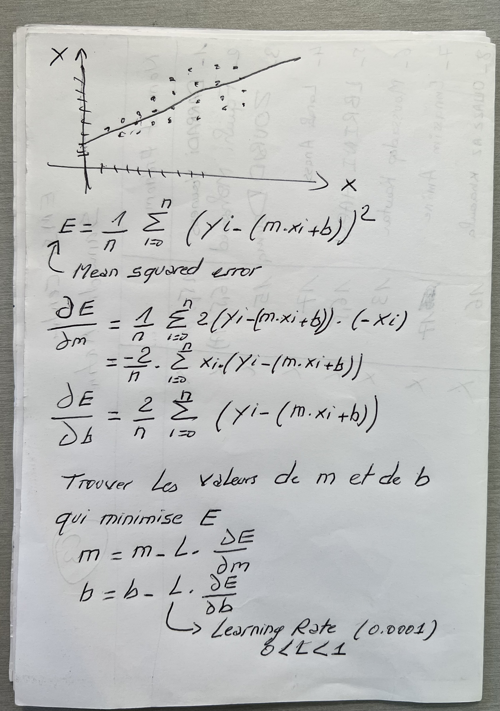
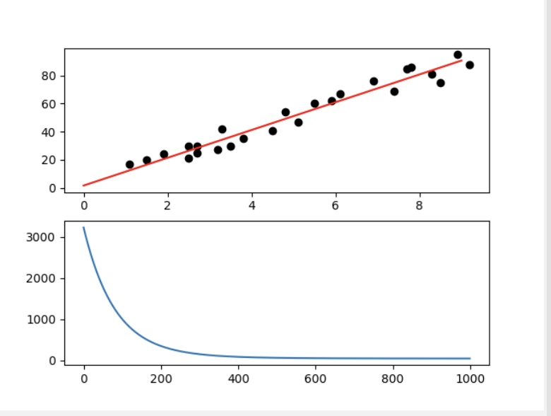

<h2>Simple Linear regression with Python</h2>

regression=9.896964110671043*x+1.6314708810783125
Hours  Scores  predicted
0     2.5      21  26.373881
1     5.1      47  52.105988
2     3.2      27  33.301756
3     8.5      75  85.755666
4     3.5      30  36.270845
5     1.5      20  16.476917
6     9.2      88  92.683541
7     5.5      60  56.064773
8     8.3      81  83.776273
9     2.7      25  28.353274
10    7.7      85  77.838095
11    5.9      62  60.023559
12    4.5      41  46.167809
13    3.3      42  34.291452
14    1.1      17  12.518131
15    8.9      95  89.714451
16    2.5      30  26.373881
17    1.9      24  20.435703
18    6.1      67  62.002952
19    7.4      69  74.869005
20    2.7      30  28.353274
21    4.8      54  49.136899
22    3.8      35  39.239935
23    6.9      76  69.920523
24    7.8      86  78.827791