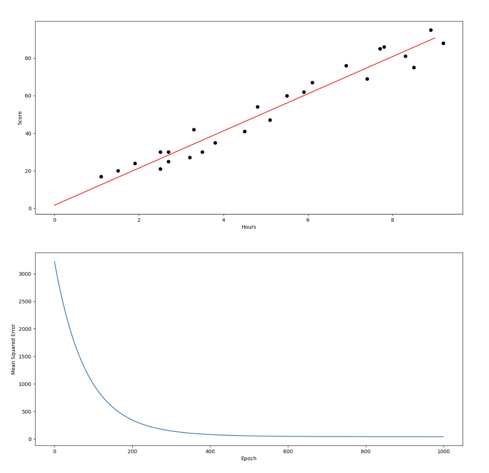

<h2>Simple Linear regression with Python</h2>

<pre>
regression=9.896964110671043*x+1.6314708810783125
+----+---------+----------+-------------+
|    |   Hours |   Scores |   predicted |
|----+---------+----------+-------------|
|  0 |     2.5 |       21 |     26.3739 |
|  1 |     5.1 |       47 |     52.106  |
|  2 |     3.2 |       27 |     33.3018 |
|  3 |     8.5 |       75 |     85.7557 |
|  4 |     3.5 |       30 |     36.2708 |
|  5 |     1.5 |       20 |     16.4769 |
|  6 |     9.2 |       88 |     92.6835 |
|  7 |     5.5 |       60 |     56.0648 |
|  8 |     8.3 |       81 |     83.7763 |
|  9 |     2.7 |       25 |     28.3533 |
| 10 |     7.7 |       85 |     77.8381 |
| 11 |     5.9 |       62 |     60.0236 |
| 12 |     4.5 |       41 |     46.1678 |
| 13 |     3.3 |       42 |     34.2915 |
| 14 |     1.1 |       17 |     12.5181 |
| 15 |     8.9 |       95 |     89.7145 |
| 16 |     2.5 |       30 |     26.3739 |
| 17 |     1.9 |       24 |     20.4357 |
| 18 |     6.1 |       67 |     62.003  |
| 19 |     7.4 |       69 |     74.869  |
| 20 |     2.7 |       30 |     28.3533 |
| 21 |     4.8 |       54 |     49.1369 |
| 22 |     3.8 |       35 |     39.2399 |
| 23 |     6.9 |       76 |     69.9205 |
| 24 |     7.8 |       86 |     78.8278 |
+----+---------+----------+-------------+
</pre>